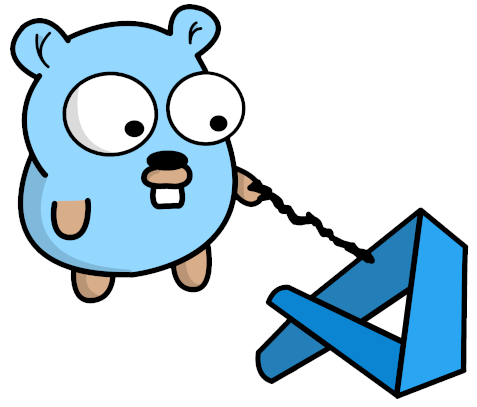

# vscode-go-tools-extension-template

This is a template repository to get you started on building a VS Code extension for your favorite Go tool. It could be a linter, formatter, or code analysis, or all of those together. This template will give you the basic building blocks you need to build a VS Code extension for it.
